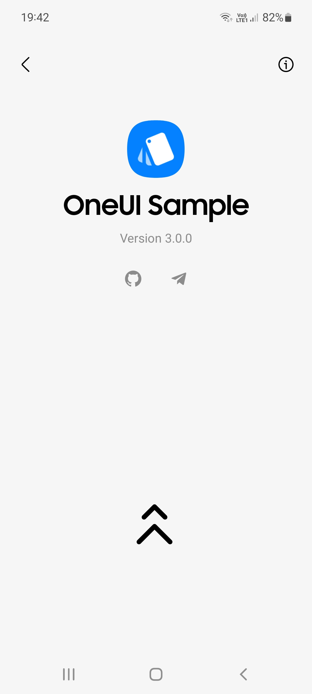
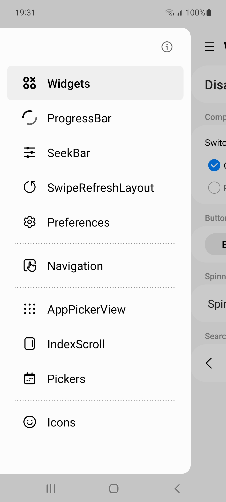
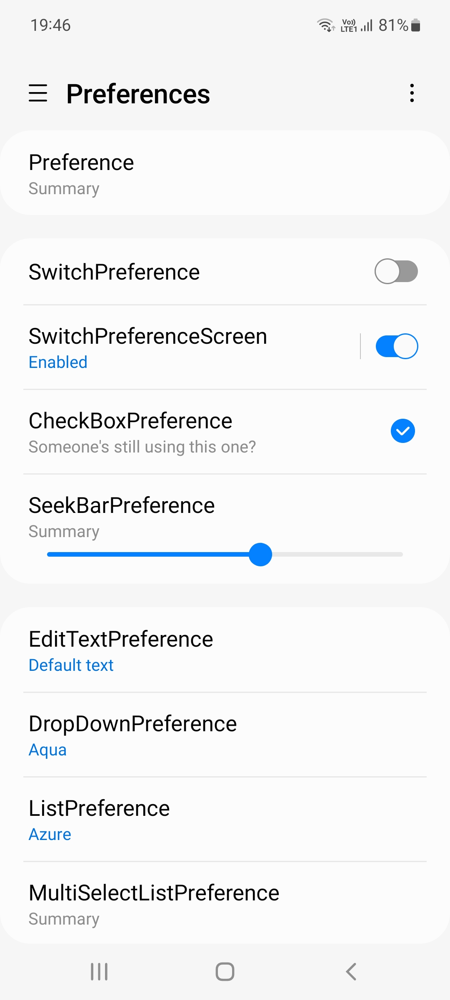
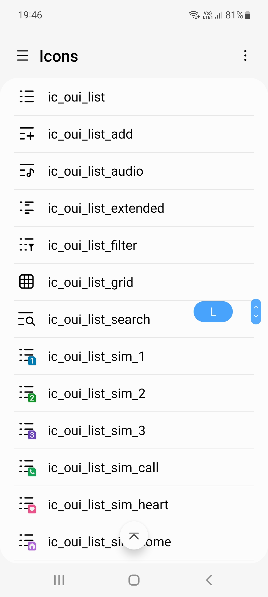
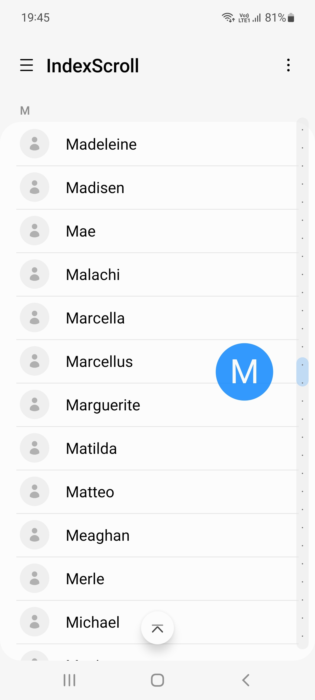

<p align="center">
  
  <br><br>
  <a href="https://t.me/oneuiproject"></a>
  <a href="https://mvnrepository.com/artifact/io.github.oneuiproject/design"></a>
  <h3 align="center"><a href="https://github.com/OneUIProject/oneui-design/raw/main/sample-app/release/sample-app-release.apk">Download Sample APK</a></h3>
</p>

<h1></h1>

In this repository you'll find:
- Source code of the [oneui-design library](#oneui-design-module);
- Source code of our [One UI Sample app](#oneui-sample-app);

Any form of contribution, suggestions, bug report or feature request will be welcome.

# OneUI Design Module

The "oneui-design" library (not to be confused with the old [OneUI Design Library](https://github.com/OneUIProject/OneUI-Design-Library)) consists of custom components made to help you implement One UI in your apps with ease, if you're actually interested on the base libraries please take a look at [oneui-core](https://github.com/OneUIProject/oneui-core). Check our [documentation page](https://oneuiproject.github.io/design/) to learn more about this module.

## Usage

- Make sure your Android project has [oneui-core](https://github.com/OneUIProject/oneui-core#usage) libraries implemented;

- Add the design library in your dependencies:
```groovy
dependencies {
    // ...
    implementation 'io.github.oneuiproject:design:<version>'
}
```

- Apply the main theme in your AndroidManifest file:
```xml
<application
    ...
    android:theme="@style/OneUITheme" >
    ...
</application>
```

# OneUI Sample App

<p align="center">    </p>

The One UI Sample app has been made to showcase the components from both our [oneui-core](https://github.com/OneUIProject/oneui-core) libraries and [oneui-design](#oneui-design-module) module. You can download the latest apk [here](https://github.com/OneUIProject/oneui-design/raw/main/sample-app/release/sample-app-release.apk), for the older versions of the app please check the deprecated [OneUI Design Library](https://github.com/OneUIProject/OneUI-Design-Library) repository.

## Features
- Supports Android 6.0 (api 23) and above;
- Supports both Samsung and non-Samsung devices;
- One UI 4 Color Theme support;
- Example UI for the following components:
  - AppCompat (Base widgets/theme);
  - Material Components ([Tabs](https://material.io/components/tabs), [Bottom navigation](https://material.io/components/bottom-navigation));
  - Date/Time/Color pickers;
  - ListViews (AppPicker, Contacts, Icons);
  - Preferences;
  - Swipe to Refresh;

# More info
- [One UI 4](https://design.samsung.com/global/contents/one-ui-4/)
- [One UI Design Guide](https://developer.samsung.com/one-ui/index.html)
- [One UI Design Guide (PDF)](https://design.samsung.com/global/contents/one-ui/download/oneui_design_guide_eng.pdf)

# Special thanks
- [Google](https://developer.android.com/jetpack) for their Jetpack and Material Components libraries.
- [Samsung](https://www.samsung.com/) for their awesome OneUI Design. :)
- All the current and future [contributors](https://github.com/OneUIProject/oneui-design/graphs/contributors) and issue reporters. :D
